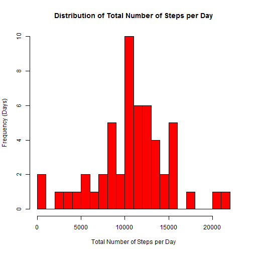
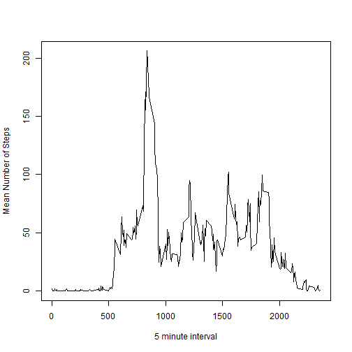
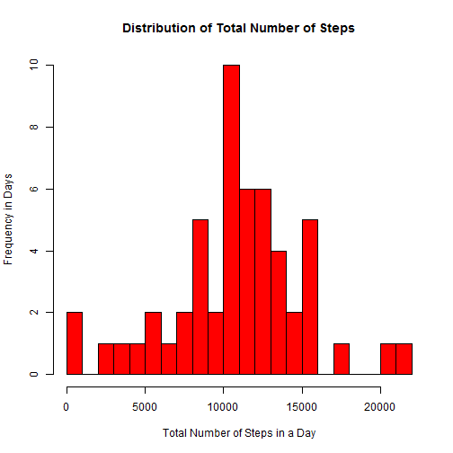
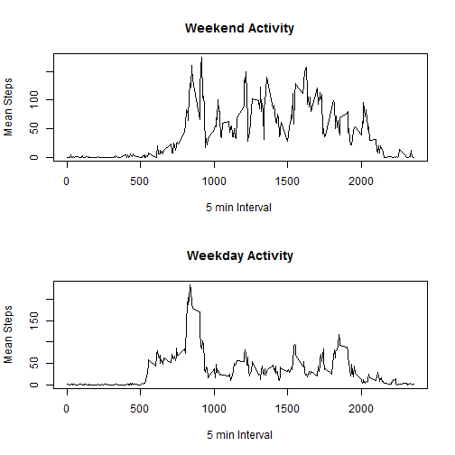

Required packages
plyr


Loading and preprocessing the data:

```r
unzip("./repdata-data-activity.zip")
activity<-read.csv("./activity.csv")
```


What is the total number of steps taken per day?

```r
library(plyr)
step_sum_mean<-ddply(activity,~date, summarize, sum=sum(steps, na.rm=FALSE), mean=mean(steps, na.rm=TRUE))
step_sum<-sum(step_sum_mean$sum, na.rm=TRUE)
step_mean<-mean(step_sum_mean$mean, na.rm=TRUE)
```

The total number of steps taken per day (sum) and the mean steps are listed below:

```
##          date   sum       mean
## 1  2012-10-01    NA        NaN
## 2  2012-10-02   126  0.4375000
## 3  2012-10-03 11352 39.4166667
## 4  2012-10-04 12116 42.0694444
## 5  2012-10-05 13294 46.1597222
## 6  2012-10-06 15420 53.5416667
## 7  2012-10-07 11015 38.2465278
## 8  2012-10-08    NA        NaN
## 9  2012-10-09 12811 44.4826389
## 10 2012-10-10  9900 34.3750000
## 11 2012-10-11 10304 35.7777778
## 12 2012-10-12 17382 60.3541667
## 13 2012-10-13 12426 43.1458333
## 14 2012-10-14 15098 52.4236111
## 15 2012-10-15 10139 35.2048611
## 16 2012-10-16 15084 52.3750000
## 17 2012-10-17 13452 46.7083333
## 18 2012-10-18 10056 34.9166667
## 19 2012-10-19 11829 41.0729167
## 20 2012-10-20 10395 36.0937500
## 21 2012-10-21  8821 30.6284722
## 22 2012-10-22 13460 46.7361111
## 23 2012-10-23  8918 30.9652778
## 24 2012-10-24  8355 29.0104167
## 25 2012-10-25  2492  8.6527778
## 26 2012-10-26  6778 23.5347222
## 27 2012-10-27 10119 35.1354167
## 28 2012-10-28 11458 39.7847222
## 29 2012-10-29  5018 17.4236111
## 30 2012-10-30  9819 34.0937500
## 31 2012-10-31 15414 53.5208333
## 32 2012-11-01    NA        NaN
## 33 2012-11-02 10600 36.8055556
## 34 2012-11-03 10571 36.7048611
## 35 2012-11-04    NA        NaN
## 36 2012-11-05 10439 36.2465278
## 37 2012-11-06  8334 28.9375000
## 38 2012-11-07 12883 44.7326389
## 39 2012-11-08  3219 11.1770833
## 40 2012-11-09    NA        NaN
## 41 2012-11-10    NA        NaN
## 42 2012-11-11 12608 43.7777778
## 43 2012-11-12 10765 37.3784722
## 44 2012-11-13  7336 25.4722222
## 45 2012-11-14    NA        NaN
## 46 2012-11-15    41  0.1423611
## 47 2012-11-16  5441 18.8923611
## 48 2012-11-17 14339 49.7881944
## 49 2012-11-18 15110 52.4652778
## 50 2012-11-19  8841 30.6979167
## 51 2012-11-20  4472 15.5277778
## 52 2012-11-21 12787 44.3993056
## 53 2012-11-22 20427 70.9270833
## 54 2012-11-23 21194 73.5902778
## 55 2012-11-24 14478 50.2708333
## 56 2012-11-25 11834 41.0902778
## 57 2012-11-26 11162 38.7569444
## 58 2012-11-27 13646 47.3819444
## 59 2012-11-28 10183 35.3576389
## 60 2012-11-29  7047 24.4687500
## 61 2012-11-30    NA        NaN
```

The total number of steps taken on all days is listed below:

```
## [1] 570608
```


The mean number of steps taken across all days is listed below:

```
## [1] 37.3826
```

Histogram of the total number of steps per day:
 

Calculate the mean and median of the total number of steps per day:

```r
mean_median_activity<-ddply(activity, ~date, summarize, mean=mean(steps, na.rm=TRUE), median=median(steps,na.rm=TRUE))
median_activity<-median(activity$steps, na.rm=TRUE)
```

The mean and median steps per day are listed below:

```
##          date       mean median
## 1  2012-10-01        NaN     NA
## 2  2012-10-02  0.4375000      0
## 3  2012-10-03 39.4166667      0
## 4  2012-10-04 42.0694444      0
## 5  2012-10-05 46.1597222      0
## 6  2012-10-06 53.5416667      0
## 7  2012-10-07 38.2465278      0
## 8  2012-10-08        NaN     NA
## 9  2012-10-09 44.4826389      0
## 10 2012-10-10 34.3750000      0
## 11 2012-10-11 35.7777778      0
## 12 2012-10-12 60.3541667      0
## 13 2012-10-13 43.1458333      0
## 14 2012-10-14 52.4236111      0
## 15 2012-10-15 35.2048611      0
## 16 2012-10-16 52.3750000      0
## 17 2012-10-17 46.7083333      0
## 18 2012-10-18 34.9166667      0
## 19 2012-10-19 41.0729167      0
## 20 2012-10-20 36.0937500      0
## 21 2012-10-21 30.6284722      0
## 22 2012-10-22 46.7361111      0
## 23 2012-10-23 30.9652778      0
## 24 2012-10-24 29.0104167      0
## 25 2012-10-25  8.6527778      0
## 26 2012-10-26 23.5347222      0
## 27 2012-10-27 35.1354167      0
## 28 2012-10-28 39.7847222      0
## 29 2012-10-29 17.4236111      0
## 30 2012-10-30 34.0937500      0
## 31 2012-10-31 53.5208333      0
## 32 2012-11-01        NaN     NA
## 33 2012-11-02 36.8055556      0
## 34 2012-11-03 36.7048611      0
## 35 2012-11-04        NaN     NA
## 36 2012-11-05 36.2465278      0
## 37 2012-11-06 28.9375000      0
## 38 2012-11-07 44.7326389      0
## 39 2012-11-08 11.1770833      0
## 40 2012-11-09        NaN     NA
## 41 2012-11-10        NaN     NA
## 42 2012-11-11 43.7777778      0
## 43 2012-11-12 37.3784722      0
## 44 2012-11-13 25.4722222      0
## 45 2012-11-14        NaN     NA
## 46 2012-11-15  0.1423611      0
## 47 2012-11-16 18.8923611      0
## 48 2012-11-17 49.7881944      0
## 49 2012-11-18 52.4652778      0
## 50 2012-11-19 30.6979167      0
## 51 2012-11-20 15.5277778      0
## 52 2012-11-21 44.3993056      0
## 53 2012-11-22 70.9270833      0
## 54 2012-11-23 73.5902778      0
## 55 2012-11-24 50.2708333      0
## 56 2012-11-25 41.0902778      0
## 57 2012-11-26 38.7569444      0
## 58 2012-11-27 47.3819444      0
## 59 2012-11-28 35.3576389      0
## 60 2012-11-29 24.4687500      0
## 61 2012-11-30        NaN     NA
```

The median steps across all days are listed below:

```
## [1] 0
```

The mean number of steps taken across all days is listed below:

```
## [1] 37.3826
```

What is the average daily activity pattern?

Time series plot of the 5-minute interval and average number of steps taken, averaged across all days

```r
step_sum_by_interval<-ddply(activity,~interval, summarize, mean=mean(steps,na.rm=TRUE))
```
 

Which 5-min interval, on average across all days, contains the maximum number of steps?

```r
max_interval<-which.max(step_sum_by_interval$mean)
```

The 5-min interval that contains the maximum number of steps is listed below:

```
## [1] 104
```

Inputting missing values

Calculate and report the total number of missing values in the dataset.

```r
NAsum<-sum(length(which(is.na(activity$steps))))
```

The total number of missing values in the dataset is listed below:

```
## [1] 2304
```


Fill in all missing values (coded as NA) in the dataset yielding a new, equal dataset called NAreplace_activity.

```r
NAreplace_activity<-activity
for (i in 1:nrow(NAreplace_activity)) {
  if (is.na(NAreplace_activity$steps[i])) {
    NAreplace_activity$steps[i]<-step_sum_by_interval[which(NAreplace_activity$interval[i]==step_sum_by_interval$interval), ]$mean
  }
}
```

Make a histogram of the total number of steps taken each day and calculate and report the mean and median total number of steps taken per day in NAreplace_activity.  
 


Calculate and report the mean and median total number of steps taken per day in the new data set in which the NAs have been replaced.


```r
mean_median_NAreplace<-ddply(NAreplace_activity, ~date, summarize, mean=mean(steps), median=median(steps))
meanNAreplace<-mean(NAreplace_activity$steps)
medianNAreplace<-median(NAreplace_activity$steps)
sumStepsNAreplace<-sum(NAreplace_activity$steps)
sumStepsNAreplace_daily<-ddply(NAreplace_activity, ~date, summarize, NAreplace_steps=sum(steps))
```

The mean and median of the new data set in which the NAs have been replaced are listed below:

```
##          date       mean   median
## 1  2012-10-01 37.3825996 34.11321
## 2  2012-10-02  0.4375000  0.00000
## 3  2012-10-03 39.4166667  0.00000
## 4  2012-10-04 42.0694444  0.00000
## 5  2012-10-05 46.1597222  0.00000
## 6  2012-10-06 53.5416667  0.00000
## 7  2012-10-07 38.2465278  0.00000
## 8  2012-10-08 37.3825996 34.11321
## 9  2012-10-09 44.4826389  0.00000
## 10 2012-10-10 34.3750000  0.00000
## 11 2012-10-11 35.7777778  0.00000
## 12 2012-10-12 60.3541667  0.00000
## 13 2012-10-13 43.1458333  0.00000
## 14 2012-10-14 52.4236111  0.00000
## 15 2012-10-15 35.2048611  0.00000
## 16 2012-10-16 52.3750000  0.00000
## 17 2012-10-17 46.7083333  0.00000
## 18 2012-10-18 34.9166667  0.00000
## 19 2012-10-19 41.0729167  0.00000
## 20 2012-10-20 36.0937500  0.00000
## 21 2012-10-21 30.6284722  0.00000
## 22 2012-10-22 46.7361111  0.00000
## 23 2012-10-23 30.9652778  0.00000
## 24 2012-10-24 29.0104167  0.00000
## 25 2012-10-25  8.6527778  0.00000
## 26 2012-10-26 23.5347222  0.00000
## 27 2012-10-27 35.1354167  0.00000
## 28 2012-10-28 39.7847222  0.00000
## 29 2012-10-29 17.4236111  0.00000
## 30 2012-10-30 34.0937500  0.00000
## 31 2012-10-31 53.5208333  0.00000
## 32 2012-11-01 37.3825996 34.11321
## 33 2012-11-02 36.8055556  0.00000
## 34 2012-11-03 36.7048611  0.00000
## 35 2012-11-04 37.3825996 34.11321
## 36 2012-11-05 36.2465278  0.00000
## 37 2012-11-06 28.9375000  0.00000
## 38 2012-11-07 44.7326389  0.00000
## 39 2012-11-08 11.1770833  0.00000
## 40 2012-11-09 37.3825996 34.11321
## 41 2012-11-10 37.3825996 34.11321
## 42 2012-11-11 43.7777778  0.00000
## 43 2012-11-12 37.3784722  0.00000
## 44 2012-11-13 25.4722222  0.00000
## 45 2012-11-14 37.3825996 34.11321
## 46 2012-11-15  0.1423611  0.00000
## 47 2012-11-16 18.8923611  0.00000
## 48 2012-11-17 49.7881944  0.00000
## 49 2012-11-18 52.4652778  0.00000
## 50 2012-11-19 30.6979167  0.00000
## 51 2012-11-20 15.5277778  0.00000
## 52 2012-11-21 44.3993056  0.00000
## 53 2012-11-22 70.9270833  0.00000
## 54 2012-11-23 73.5902778  0.00000
## 55 2012-11-24 50.2708333  0.00000
## 56 2012-11-25 41.0902778  0.00000
## 57 2012-11-26 38.7569444  0.00000
## 58 2012-11-27 47.3819444  0.00000
## 59 2012-11-28 35.3576389  0.00000
## 60 2012-11-29 24.4687500  0.00000
## 61 2012-11-30 37.3825996 34.11321
```

The mean across all days is listed below:

```r
meanNAreplace
```

```
## [1] 37.3826
```

The median across all days is listed below:

```r
medianNAreplace
```

```
## [1] 0
```


Do these values differ from the estimates from the first part of the assignment?
Answer: These values do not appear to be different.

What is the impact of imputing missing data on the estimates of the total daily number of steps?

The total number of steps per day in the original activity data compared to the step sums in the new data set with NAs removed is listed below:

```
##       [,1]  [,2]     [,3]
##  [1,]    1    NA 10766.19
##  [2,]    2   126   126.00
##  [3,]    3 11352 11352.00
##  [4,]    4 12116 12116.00
##  [5,]    5 13294 13294.00
##  [6,]    6 15420 15420.00
##  [7,]    7 11015 11015.00
##  [8,]    8    NA 10766.19
##  [9,]    9 12811 12811.00
## [10,]   10  9900  9900.00
## [11,]   11 10304 10304.00
## [12,]   12 17382 17382.00
## [13,]   13 12426 12426.00
## [14,]   14 15098 15098.00
## [15,]   15 10139 10139.00
## [16,]   16 15084 15084.00
## [17,]   17 13452 13452.00
## [18,]   18 10056 10056.00
## [19,]   19 11829 11829.00
## [20,]   20 10395 10395.00
## [21,]   21  8821  8821.00
## [22,]   22 13460 13460.00
## [23,]   23  8918  8918.00
## [24,]   24  8355  8355.00
## [25,]   25  2492  2492.00
## [26,]   26  6778  6778.00
## [27,]   27 10119 10119.00
## [28,]   28 11458 11458.00
## [29,]   29  5018  5018.00
## [30,]   30  9819  9819.00
## [31,]   31 15414 15414.00
## [32,]   32    NA 10766.19
## [33,]   33 10600 10600.00
## [34,]   34 10571 10571.00
## [35,]   35    NA 10766.19
## [36,]   36 10439 10439.00
## [37,]   37  8334  8334.00
## [38,]   38 12883 12883.00
## [39,]   39  3219  3219.00
## [40,]   40    NA 10766.19
## [41,]   41    NA 10766.19
## [42,]   42 12608 12608.00
## [43,]   43 10765 10765.00
## [44,]   44  7336  7336.00
## [45,]   45    NA 10766.19
## [46,]   46    41    41.00
## [47,]   47  5441  5441.00
## [48,]   48 14339 14339.00
## [49,]   49 15110 15110.00
## [50,]   50  8841  8841.00
## [51,]   51  4472  4472.00
## [52,]   52 12787 12787.00
## [53,]   53 20427 20427.00
## [54,]   54 21194 21194.00
## [55,]   55 14478 14478.00
## [56,]   56 11834 11834.00
## [57,]   57 11162 11162.00
## [58,]   58 13646 13646.00
## [59,]   59 10183 10183.00
## [60,]   60  7047  7047.00
## [61,]   61    NA 10766.19
```

Are there differences in activity patterns between weekdays and weekends?

Answer: The only differences seem to exist where NAs were previously present in the original dataset, otherwise the values appear to be identical

Create a new factor variable in the dataset with two levels-"weekday" and "weekend" indicating whether a given date is a weekday or weekend day.

```r
activity$date<-as.POSIXct(activity$date)
activity$WeekDay<-weekdays(activity$date)
activity$DayFactor<-ifelse(activity$WeekDay%in%c("Monday", "Tuesday", "Wednesday", "Thursday", "Friday"), "weekday", "weekend")
```

Make time-series plots of the 5-minute activity intervals and average number of steps taken to compare weekday and weekend activity. 

```r
weekday_activity<-activity[activity$DayFactor=="weekday",]
weekday_activity<-ddply(weekday_activity, ~interval, summarize, mean=mean(steps, na.rm=TRUE))

weekend_activity<-activity[activity$DayFactor=="weekend",]
weekend_activity<-ddply(weekend_activity, ~interval, summarize, mean=mean(steps, na.rm=TRUE))
```

 
